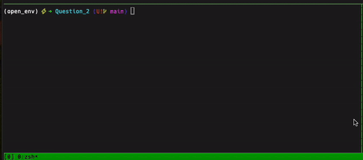

# Question 2: Rabbitmq
### How to run it
1. If you dont have  python interpreter installed:

For Windows OS
```sh
https://www.python.org/downloads/
```

For Mac OS 
```sh
brew install python
```
For Linux  OS 
```sh
sudo apt update
sudo apt install python3
```

Create the virtual environment
```sh
python3 -m venv my_venv
```

Activate the virtual environment
```sh
source my_venv/bin/activate
```
Install the requirements
```sh
pip install -r requirements.txt
```

2. Run the Rabbitmq container using docker-compose

If you dont have docker-compose installed:
For Mac OS 
```sh
brew install docker-compose
```

For Linux  OS 
```sh
sudo apt update
sudo apt install docker-compose
```

For Windows OS
```sh
https://docs.docker.com/compose/install/
```

Go inside the Question_2/ folder and run the following:
```sh
docker-compose up --build -d
```
This will pull the rabbitmq image and run it in the background.

3. Run the main.py program it is a rabbitmq client to connect , configure and send the message "Hello World!" to the queue .
```sh
python main.py
```



### Description and directory  structure 
```sh
├── README.md
├── docker-compose.yml
├── main.py
├── media
│   └── rabbitmq.gif
├── open_env
│   ├── bin
│   ├── include
│   ├── lib
│   └── pyvenv.cfg
└── requirements.txt

6 directories, 6 files
```
**Setup Rabbitmq**:
- Exchange: is set to default. It means that the routing key will match with the queue name. 
- Queue: The queue is named "test_queue" and it is durable. It means that the queue will survive a broker restart.
- ack: The message is acknowledged by the consumer. It means that the message is removed from the queue when the consumer receives it.
- Channel management: The channel is closed after the message is sent. And each function send_message() and consume_message() creates a new channel. **Multiplexing happens** 

### Requirements.txt
```sh
pika==1.3.2
```

## Some considerations 

When sending the message the connection is close. It is a good practice to close the connection after the message is sent. 

When consuming the message the program hang so the user can decide to exit by pressing Ctrl + C. This is because I want to show the message is consumed only once and the queue is empty.

